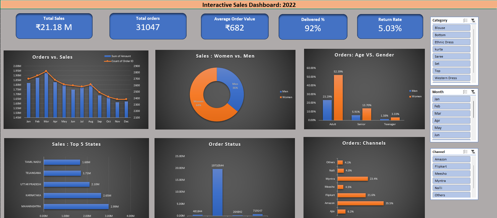

# store-sales-analysis
Interactive Excel dashboard analyzing Vrinda Store sales performance using Pivot Tables, Charts, KPIs, and Slicers.

# 📌 Project Overview
This project is an interactive sales dashboard built in Microsoft Excel to analyze the sales performance of Vrinda Store. The dashboard provides business insights using Pivot Tables, Pivot Charts, KPIs, and Slicers, helping stakeholders understand sales trends, customer behavior, and regional performance.

# 🎯 Objectives
Analyze overall sales performance.
Identify top-performing states and product categories.
Understand customer demographics.
Track monthly sales trends.
Provide business insights for better decision-making

# 🛠️ Tools & Features Used
Microsoft Excel
Pivot Tables
Pivot Charts
Slicers
Conditional Formatting
KPI Cards
Data Cleaning

# 📂 Dataset
The dataset contains information about:
Customer details
Product categories
Sales amount
Order status
States
Gender
Age group
Order date

# 📈 Dashboard Features
Interactive slicers for dynamic filtering
Monthly sales analysis
State-wise sales analysis
Category-wise sales analysis
Customer demographic analysis
Order status visualization
KPI summary cards

# 📊 Key Performance Indicators (KPIs)
Total Sales
Total Orders
Average Order Value (AOV)
Top Selling State
Top Selling Category
Best Performing Month

# ❓ Business Questions Answered
Which month recorded the highest sales?
Which state generated the most revenue?
Which product category performed the best?
Which customer segment contributed the highest sales?
What is the distribution of order statuses?

# 💡 Key Insights
Women contributed a significant share of total sales.
Adults were the highest purchasing customer segment.
The top-performing state generated the highest revenue.
Seasonal trends influenced monthly sales.
A small number of categories contributed a large portion of overall sales.

# 📁 Project Files
Vrinda Store Analysis.xlsx – Excel dashboard
dataset.csv – Source dataset
dashboard.png – Dashboard preview
README.md – Project documentation

# 🚀 Skills Demonstrated
Data Cleaning
Data Analysis
Business Analysis
Dashboard Design
Data Visualization
Excel Reporting
KPI Development

# 📷 Dashboard Preview

# 📬 Contact

If you have any feedback or suggestions, feel free to connect with me through my GitHub profile.
⭐ If you found this project useful, consider giving it a star!

